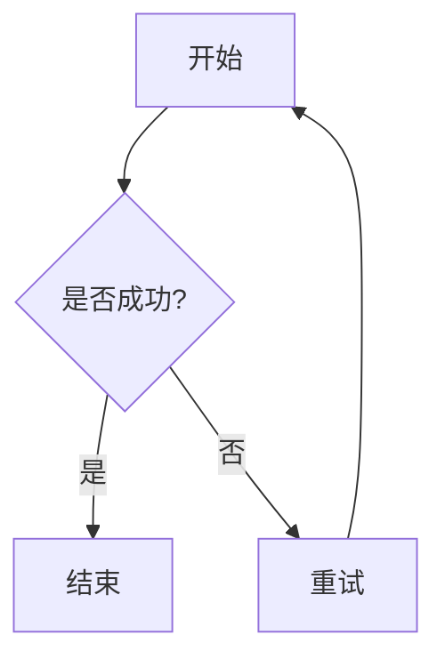
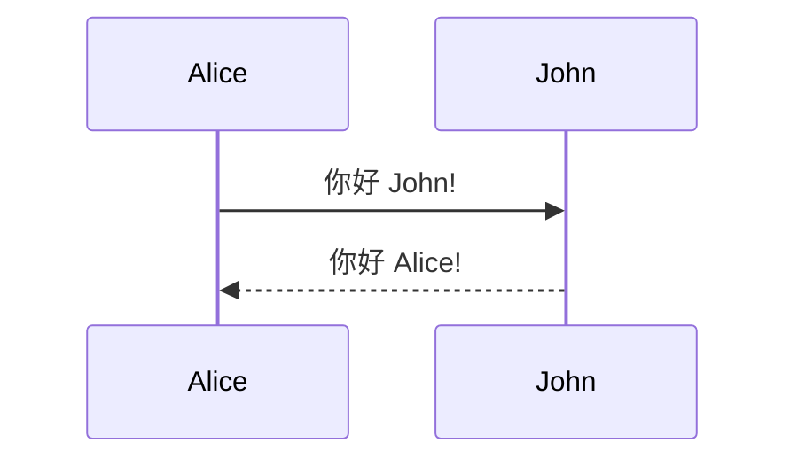

# Mermaid 测试

## 简单流程图

```mermaid
graph TD
    A[开始] --> B{是否成功?}
    B -->|是| C[结束]
    B -->|否| D[重试]
    D --> A
```

## 时序图

```mermaid
sequenceDiagram
    Alice->>John: 你好 John!
    John-->>Alice: 你好 Alice!
```
